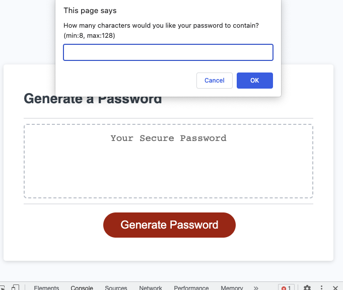

# functional-password-generator

## Description

- The Goal: 
"This application will enable users to generate random passwords based on criteria that they’ve selected. It will run in the browser and feature dynamically updated HTML and CSS powered by JavaScript(JS). It will have a clean and polished, responsive user interface that adapts to multiple screen sizes."**

- The Work:
I will modify a starter code and render it functional, it is currently unable to generate a password. 
Not much needs to be touched up on the HTML and CSS codes, the heavy load will fall upon modifying the JS code. 
This project will enable me to test the limits of my knowledge and understanding of how the core JS concepts are applied and integrated in a functional setting. 

Looks like this: 

Link: 

## Instalations

N/A

## Usage

This application absovles the user from making a lot of decisions, they will get to select the desired criterias, and the application will generate a password for them. That way the user does not have to waste time coming up with a password or worrying about whether it's strong enough or not, they can trust this application to do the work for them.

## Credits

Starter Codes:

 HTML: https://ucdavis.bootcampcontent.com/ucdavis-boot-camp/UCD-VIRT-FSF-PT-03-2023-U-LOLC/-/blob/main/03-JavaScript/02-Challenge/Develop/index.html
 
 CSS: https://ucdavis.bootcampcontent.com/ucdavis-boot-camp/UCD-VIRT-FSF-PT-03-2023-U-LOLC/-/blob/main/03-JavaScript/02-Challenge/Develop/style.css
 
 JS: https://ucdavis.bootcampcontent.com/ucdavis-boot-camp/UCD-VIRT-FSF-PT-03-2023-U-LOLC/-/blob/main/03-JavaScript/02-Challenge/Develop/script.js

** from their README file 

  https://ucdavis.bootcampcontent.com/ucdavis-boot-camp/UCD-VIRT-FSF-PT-03-2023-U-LOLC/-/blob/main/03-JavaScript/02-Challenge/README.md

## License

MIT License

